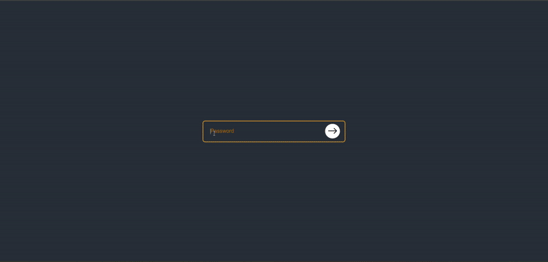
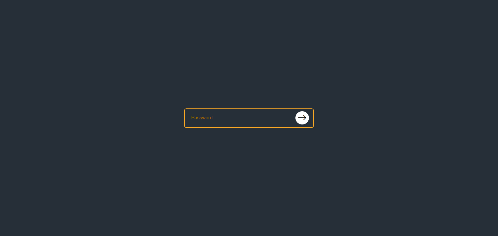
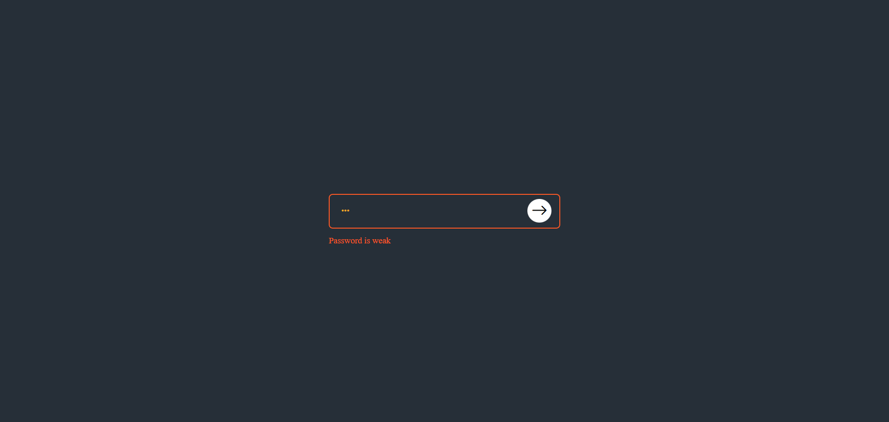
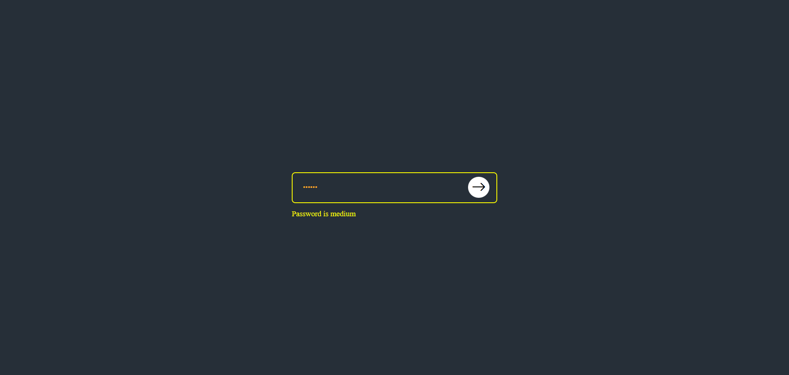
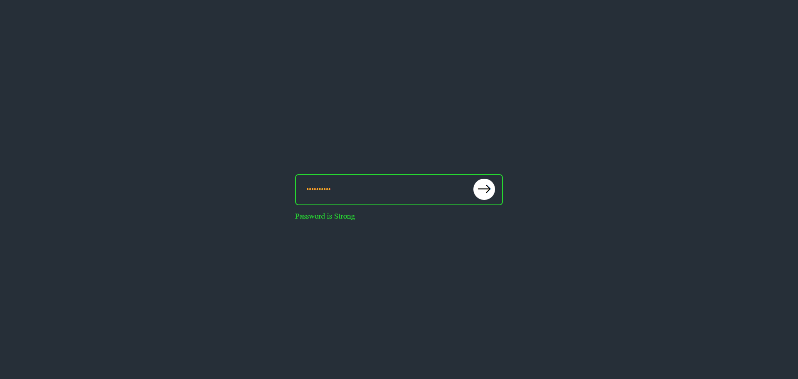
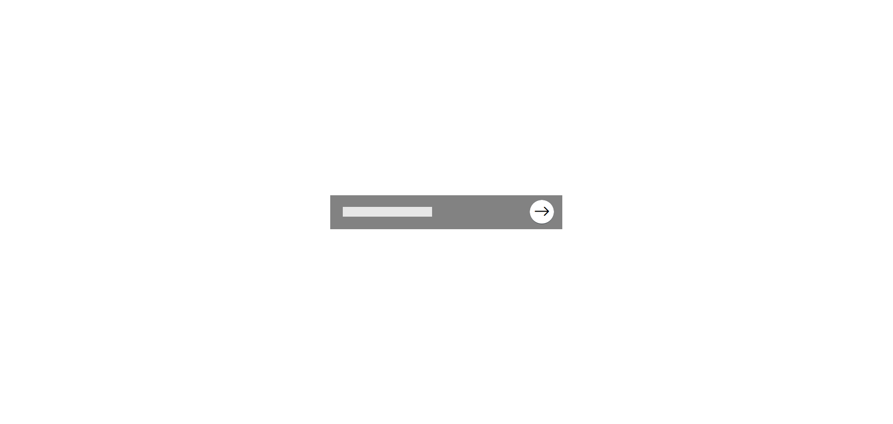
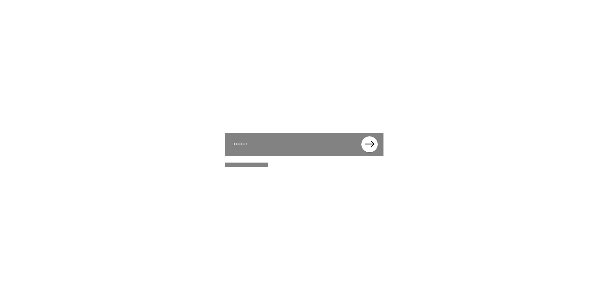
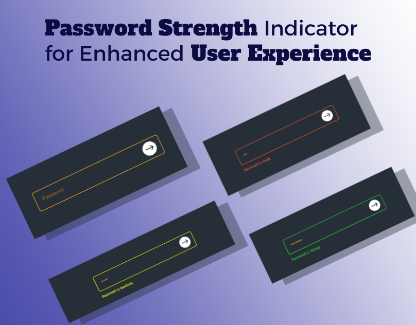

## Password Strength Indicator for Enhanced User Experience
<a href="https://www.linkedin.com/in/dharmendraverma95/" target="_blank">LinkedIn Profile </a>

<a href="https://www.behance.net/dhirukumar" target="_blank">Behance Profile </a>

## Project Overview
This project implements a real-time password strength indicator to provide users with instant feedback on the strength of their chosen passwords. It helps enhance user experience by guiding them to create stronger, more secure passwords. By using visual indicators (such as color-coded bars or text), users can see how strong or weak their passwords are during the creation process.

## Features
- **Real-Time Password Strength Evaluation**: As the user types, the password strength is evaluated and displayed instantly.
- **Visual Feedback**: Password strength is shown through color-coded bars or text indicators ranging from "Weak" to "Strong."
- **User-Friendly Design**: Simple and intuitive design that enhances user experience.
- **Security Best Practices**: Promotes the use of complex and secure passwords to improve overall system security.
  

###### Lang
<ul>
  <li>HTML5</li>
  <li>CSS3</li>
  <li>Bootstrap Icon</li>
  <li>ChatGPT [For Content]</li>
  <li>ui / ui layout Design</li>
  <li>desgin in Abode XD</li>
</ul>

 
Desktop Design 

 
Desktop UI UX Design 

 
Desktop Design ui-ux Layout 

 
Desktop Design 

Cover 
